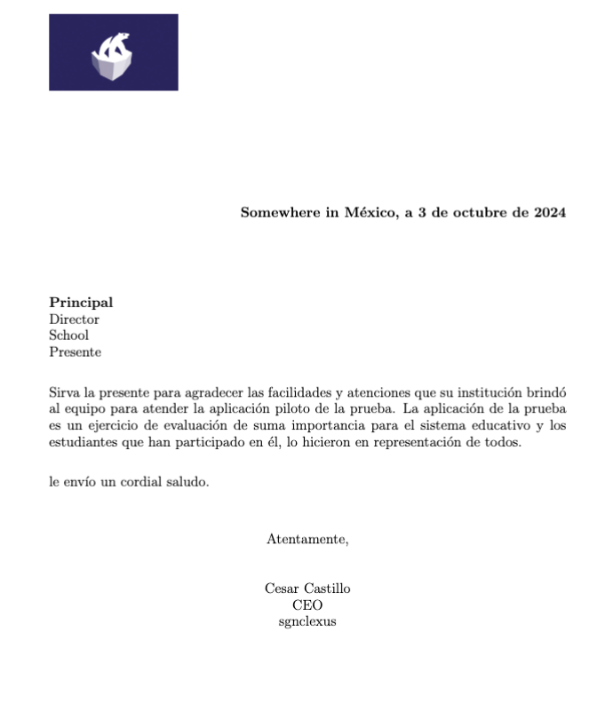
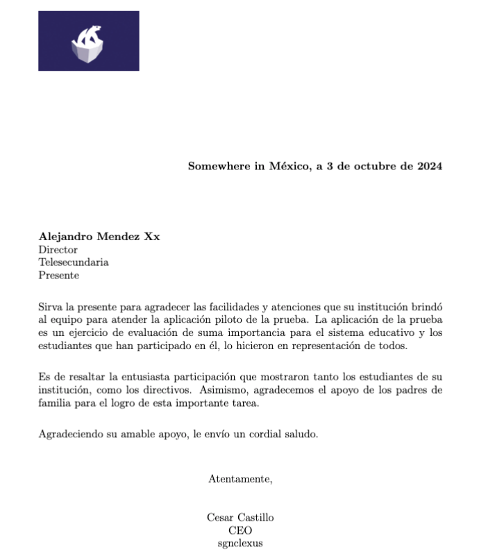

# Project Title

## Table of Contents

- [About](#about)
- [Getting Started](#getting_started)
- [Usage](#usage)


## About <a name = "about"></a>

This project has some samples of how to use LaTeX and python to get info from csv and merge into LaTeX template to get pdf files 

## Getting Started <a name = "getting_started"></a>

These instructions will get you a copy of the project up and running on your local machine for development and testing purposes. See [deployment](#deployment) for notes on how to deploy the project on a live system.

### Prerequisites

You need to install the following software 

```
LaTeX
```

Note: You need to be patience, because you need to download all libraries of TexLive and there are a lot (10GB). This libraries are required to use LaTeX

### Installing

For this example you will need TexLive to work. For windows you need to add to environmental variables the bin carpet of tex Live. For mac is similar, but different because you need to install the package MacTeX.pkg. After installing to start work with LaTeX Workshop you need to add the directory of TeX Live binaries to your PATH environment on mac

To add the directory of TeX Live binaries to your PATH environment on macOS, follow these steps:

Locate the TeX Live Binary Path: The TeX Live binaries are typically located in a directory like /usr/local/texlive/YYYY/bin/x86_64-darwin, where YYYY is the version year of TeX Live (e.g., 2023).

You can confirm the exact location of the binaries by running the following command in the terminal:

```
ls /usr/local/texlive/
```

This will list the installed TeX Live versions. Choose the one you're using (e.g., 2023), and locate the bin/x86_64-darwin or bin/universal-darwin directory within it.

Edit the Shell Profile File: To add the TeX Live binary directory to your PATH, you need to edit your shell's profile file. The file to edit depends on which shell you are using:

For bash: Edit the ~/.bash_profile or ~/.bashrc.
For zsh (default for newer macOS versions): Edit the ~/.zshrc.

Open the appropriate file in a text editor, for example:

```
nano ~/.zshrc
vim ~/.zshrc
```

or

```
nano ~/.bash_profile
vim ~/.bash_profile
```

Add the TeX Live Binary Path: Add the following line at the end of the file, replacing YYYY with your TeX Live version year (e.g., 2023):

```
export PATH="/usr/local/texlive/YYYY/bin/x86_64-darwin:$PATH"
```

Save and Close the File: After editing, save the file and close the editor. In nano, press CTRL + O to save and CTRL + X to exit.

Apply the Changes: After editing the profile file, reload the environment to apply the changes:

```
source ~/.zshrc  # or ~/.bash_profile for bash
```

Verify the Path: Finally, verify that the TeX Live binaries have been added to your PATH by running:

```
echo $PATH
```
You should see the TeX Live binary directory listed.

With this configuration the extension LaTeX Workshop will work!

After this use any extension of vs code to preview the result of your LaTeX template. In this example we use  


In the case of the python file, I recommend you to install a virtual environment with the libraries you need.

Steps to create virtual environment

```
python3 -m venv venv
source venv/bin/activate
```


Example of output.

```
python src/merge_csv_latex.py
```

The output for each row in the csv file

Gretting PDF File



Student User PDF File



## Usage <a name = "usage"></a>

In case you want to merge info from a database like excel or in this case CSV file you can use this code to merge info to LaTeX template and get an output.


